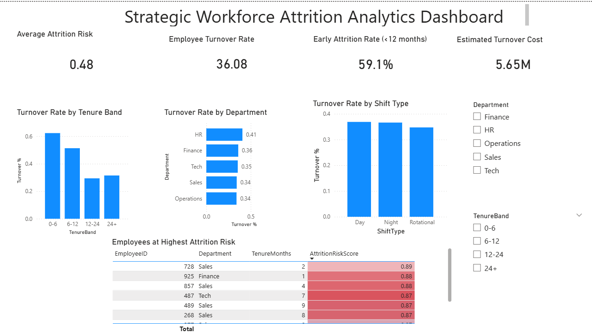

# Strategic Workforce Attrition Analytics Dashboard

This project demonstrates an end-to-end workforce attrition analytics pipeline combining **Python analytics, machine learning risk scoring, and Power BI visualization**.

## Project Overview

Employee attrition is a major challenge for organizations due to the cost of hiring, training, and lost productivity.
This project analyzes workforce data to identify **drivers of employee turnover and predict high-risk employees**.

The dashboard enables HR teams to quickly understand:

• Overall employee turnover trends
• Early attrition patterns
• Department-level attrition risk
• Shift-based attrition differences
• Employees with the highest attrition probability

## Technologies Used

Python
Pandas
Scikit-Learn
Power BI

## Key Features

**Workforce Diagnostics**

• Overall turnover rate
• Early attrition rate (<12 months)
• Estimated turnover cost

**Attrition Analysis**

• Attrition rate by tenure band
• Attrition rate by department
• Attrition rate by shift type

**Predictive Risk Scoring**

A machine learning model generates an **Attrition Risk Score** for each employee, helping HR teams identify employees who may leave soon.

**Executive Dashboard**

The Power BI dashboard provides an interactive view of workforce risk indicators with filters for department and tenure bands.

## Dashboard Preview

## Business Value

This solution helps organizations:

• Identify high-risk employees early
• Understand drivers of workforce turnover
• Reduce recruitment and replacement costs
• Improve workforce retention strategies
